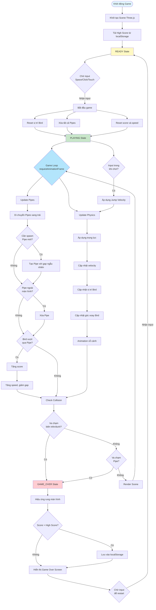
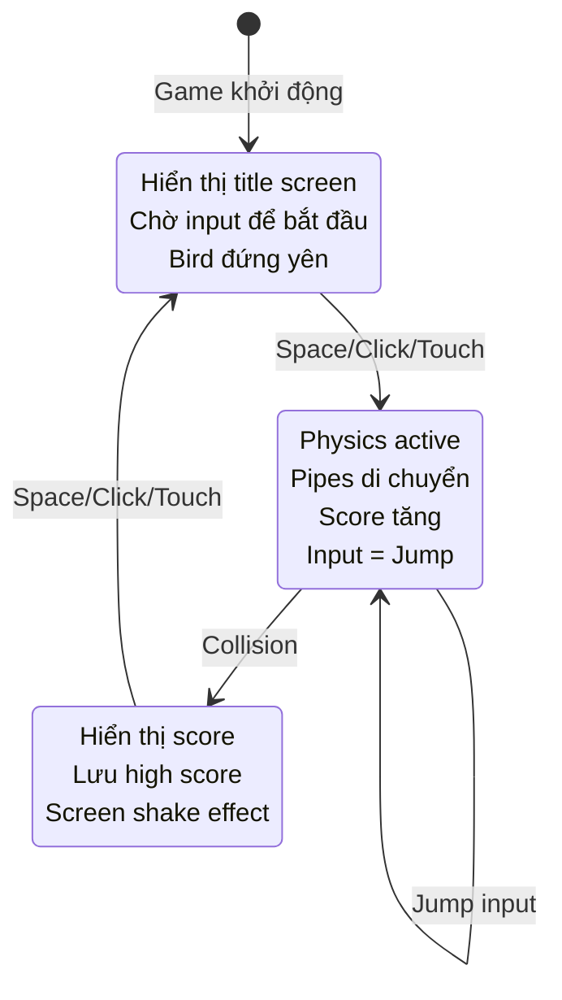
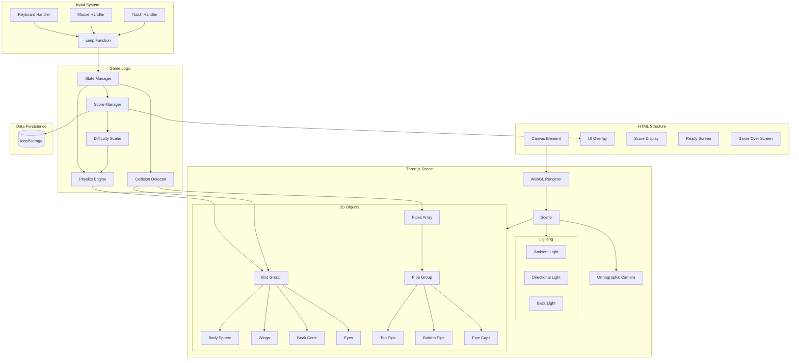
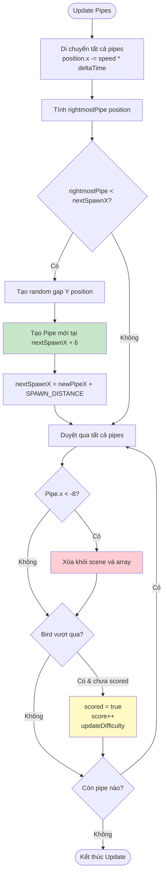
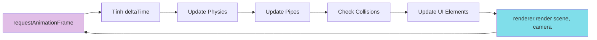
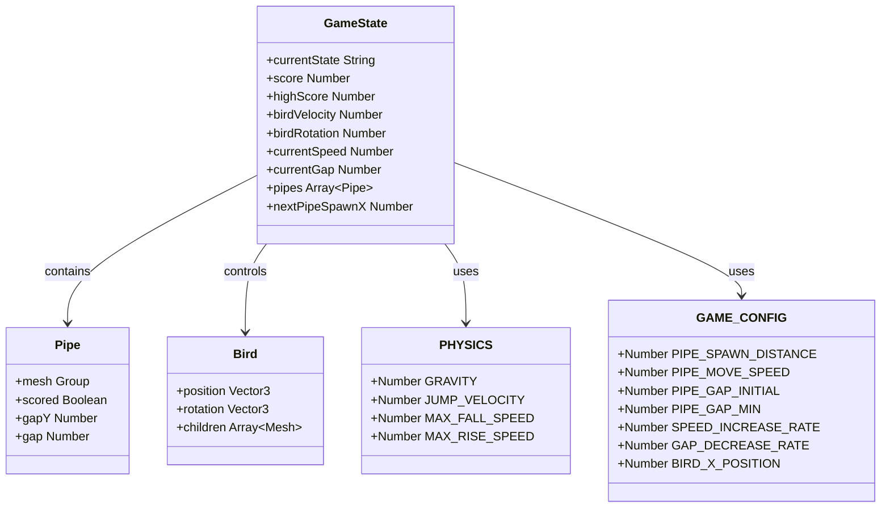

# 🏗️ Flappy Bird 3D - Kiến trúc & Luồng Code

Tài liệu này mô tả chi tiết kiến trúc và luồng hoạt động của game Flappy Bird 3D.

## 📊 Sơ đồ Luồng Game (Game Flow)

## 🔄 Sơ đồ Máy trạng thái (State Machine)

## 🧩 Sơ đồ Components (Component Diagram)

## 🎯 Luồng Xử lý Physics (Physics Pipeline)

```mermaid
flowchart LR
    Input[User Input] --> Jump[Set velocity = JUMP_VELOCITY]
    Jump --> Frame[Animation Frame]
    
    Frame --> Delta[Calculate deltaTime]
    Delta --> Gravity[velocity -= GRAVITY * deltaTime]
    Gravity --> Clamp[Clamp velocity<br/>MIN to MAX]
    Clamp --> Position[position.y += velocity * deltaTime]
    Position --> Rotation[Calculate target rotation<br/>based on velocity]
    Rotation --> Lerp[Smooth rotation<br/>using lerp]
    Lerp --> Apply[Apply to Bird mesh]
    Apply --> NextFrame[Next Frame]
    NextFrame --> Frame
    
    style Input fill:#bbdefb
    style Jump fill:#c5e1a5
    style Frame fill:#fff9c4
    style Apply fill:#ffccbc
```

## 🎮 Luồng Quản lý Pipes (Pipe Management)

## 🎨 Luồng Render (Render Pipeline)

## 📦 Cấu trúc Data (Data Structure)

## 🔧 Các Hàm Chính (Main Functions)

| Tên Hàm | Mô tả | Input | Output |
|---------|-------|-------|--------|
| `createBird()` | Tạo 3D model của Bird | - | Bird Group |
| `createPipe(x, gapY, gap)` | Tạo cặp pipe tại vị trí x | x, gapY, gap | Pipe Object |
| `resetGame()` | Reset tất cả game state | - | void |
| `startGame()` | Bắt đầu game mới | - | void |
| `gameOver()` | Kết thúc game | - | void |
| `jump()` | Xử lý input jump | - | void |
| `updatePhysics(dt)` | Cập nhật vật lý Bird | deltaTime | void |
| `updatePipes(dt)` | Quản lý pipes | deltaTime | void |
| `checkCollisions()` | Kiểm tra va chạm | - | void |
| `updateDifficulty()` | Tăng độ khó | - | void |

## ⚡ Performance Optimizations

1. **Object Pooling**: Pipes được tạo và xóa động để tránh memory leak
2. **Delta Time**: Physics độc lập với frame rate
3. **Bounding Box Cache**: Box3 được tạo mới mỗi frame (có thể optimize thêm)
4. **Efficient Rendering**: Chỉ render những gì cần thiết
5. **Request Animation Frame**: Sử dụng RAF thay vì setInterval

---

**📌 Lưu ý**: Tài liệu này được tạo để giải thích chi tiết cách hoạt động của game cho mục đích học tập và phát triển.
