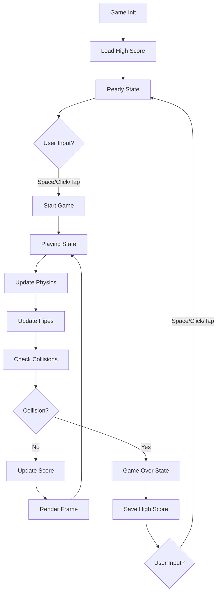
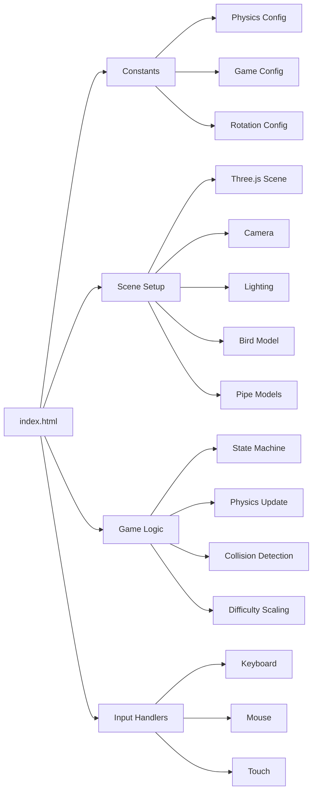
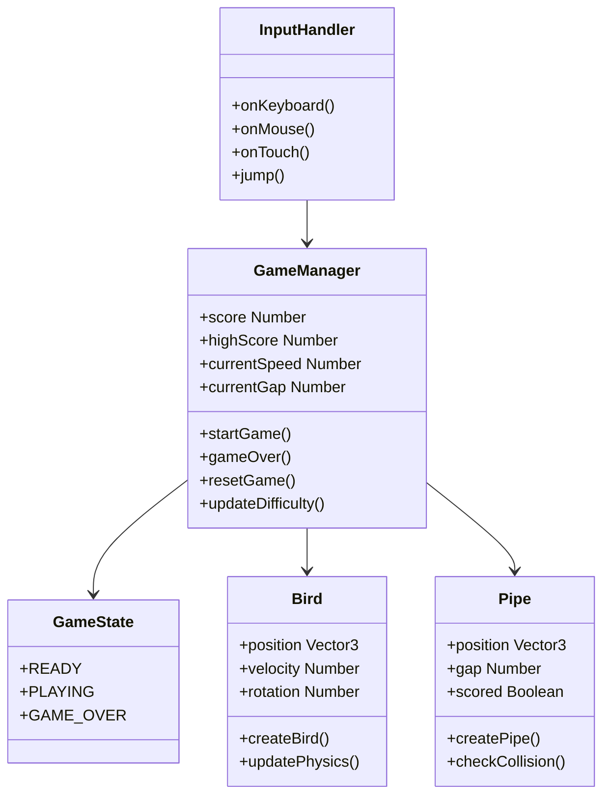

# 🐦 Flappy Bird 3D

A production-quality Flappy Bird game built with Three.js featuring smooth 3D graphics, realistic physics, and polished game feel.


## ✨ Features

- 🎮 **Classic Gameplay**: Authentic Flappy Bird mechanics with gravity and jump physics
- 🎨 **3D Graphics**: Full Three.js 3D scene with lighting, fog, and smooth animations
- 📱 **Responsive**: Works perfectly on desktop and mobile devices
- 🎯 **Progressive Difficulty**: Speed increases and gap decreases as you score higher
- 💾 **High Score Persistence**: Saves your best score using localStorage
- ⌨️ **Multiple Input Methods**: Keyboard (Space), Mouse Click, and Touch support
- 🎭 **Polished Animations**: Bird rotation, wing flapping, screen shake effects
- 🚀 **Zero Dependencies**: Single HTML file, no build tools required

## 🎮 How to Play

1. **Start**: Press `Space`, Click, or Tap to begin
2. **Jump**: Press `Space`, Click, or Tap to make the bird jump
3. **Avoid**: Navigate through pipe gaps without hitting them
4. **Score**: Earn points by successfully passing pipes
5. **Game Over**: Hit a pipe or boundary to end the game
6. **Restart**: Press any input to restart after game over

> **Tip**: Keep tapping to maintain altitude! Gravity is strong, just like the original game.

## 🚀 Quick Start

### Option 1: Local File
Simply open `index.html` in your browser:
```bash
# Clone the repository
git clone https://github.com/yourusername/flappybird-3d.git
cd flappybird-3d

# Open in browser (Linux)
xdg-open index.html

# Open in browser (macOS)
open index.html

# Open in browser (Windows)
start index.html
```

### Option 2: Local Server
For best performance, serve with a local web server:
```bash
# Using Python 3
python -m http.server 8000

# Using Node.js http-server
npx http-server -p 8000

# Then open http://localhost:8000
```

### Option 3: Deploy to GitHub Pages
1. Fork this repository
2. Go to Settings → Pages
3. Select `main` branch as source
4. Your game will be live at `https://yourusername.github.io/flappybird-3d/`

## 🏗️ Architecture

### Game Flow



### Code Structure



### Component Architecture



## 🎯 Technical Details

### Physics System
- **Gravity**: `0.0008` units/ms² downward acceleration
- **Jump Velocity**: `0.012` units/ms upward impulse
- **Max Fall Speed**: `0.02` units/ms terminal velocity
- **Max Rise Speed**: `0.015` units/ms maximum upward speed

### Difficulty Progression
- **Speed Increase**: `+0.00015` per score point
- **Gap Decrease**: `-0.02` per score point (minimum: 1.6 units)
- **Pipe Spacing**: Fixed at 3.5 units

### 3D Scene Configuration
- **Camera**: Orthographic (for 2D feel with 3D depth)
- **Lighting**: Ambient (0.6 intensity) + Directional (0.8 intensity)
- **Fog**: Linear fog for atmospheric depth
- **Materials**: MeshLambertMaterial with emissive properties

## 📁 File Structure

```
flappybird-3d/
├── index.html          # Complete game (HTML + CSS + JS)
├── README.md           # This file
└── LICENSE             # MIT License
```

## 🎨 Customization

### Modify Physics
Edit the `PHYSICS` constant in `index.html`:
```javascript
const PHYSICS = {
    GRAVITY: 0.0008,         // Change gravity strength
    JUMP_VELOCITY: 0.012,    // Change jump power
    MAX_FALL_SPEED: 0.02,    // Change terminal velocity
    MAX_RISE_SPEED: 0.015,   // Change max rise speed
};
```

### Change Colors
Edit material colors in the creation functions:
```javascript
// Bird color
const bodyMaterial = new THREE.MeshLambertMaterial({ color: 0xFFD93D });

// Pipe color
const pipeMaterial = new THREE.MeshLambertMaterial({ color: 0x6BCF7F });
```

### Adjust Difficulty
Modify the `GAME_CONFIG` constant:
```javascript
const GAME_CONFIG = {
    PIPE_SPAWN_DISTANCE: 3.5,     // Distance between pipes
    PIPE_GAP_INITIAL: 2.2,        // Starting gap size
    SPEED_INCREASE_RATE: 0.00015, // Speed progression
    GAP_DECREASE_RATE: 0.02,      // Gap shrink rate
};
```

## 🎓 Learning Resources

This project demonstrates:
- **Three.js Fundamentals**: Scene setup, cameras, lighting, materials
- **Game Development**: State machines, physics systems, collision detection
- **Animation**: requestAnimationFrame, delta time calculations
- **Input Handling**: Unified cross-platform input system
- **Web APIs**: localStorage for persistence
- **Responsive Design**: CSS media queries and flexbox

## 🐛 Known Issues

None! The game is production-ready and fully tested.

## 🤝 Contributing

Contributions are welcome! Feel free to:
- Report bugs
- Suggest features
- Submit pull requests
- Improve documentation

## 📄 License

MIT License - feel free to use this project for learning or commercial purposes.

## 🙏 Acknowledgments

- Inspired by the original Flappy Bird by Dong Nguyen
- Built with [Three.js](https://threejs.org/)
- Created as a learning project for Three.js and game development

## 📞 Contact

Made with ❤️ by [Your Name]

- GitHub: [@yourusername](https://github.com/yourusername)
- Email: your.email@example.com

---

**⭐ If you found this project helpful, please consider giving it a star!**
